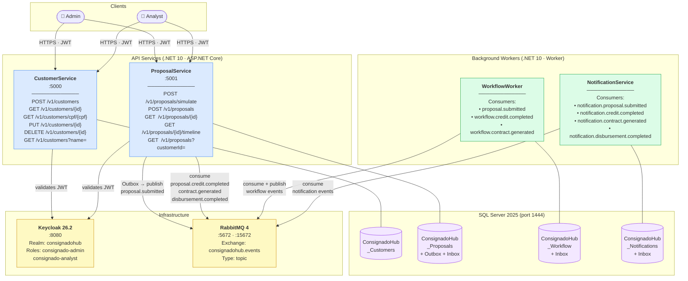
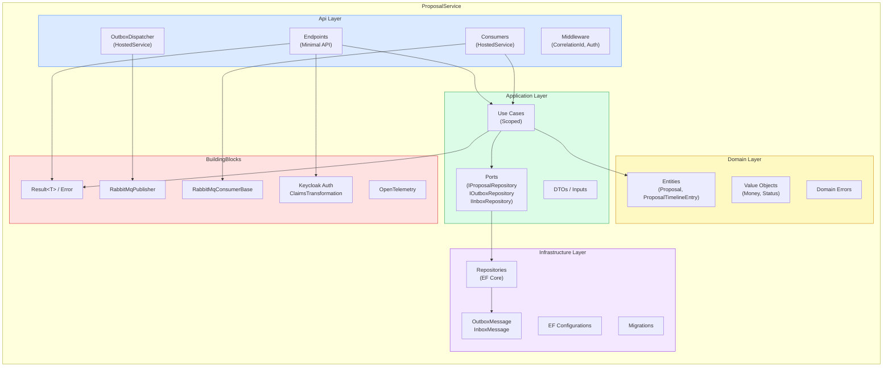
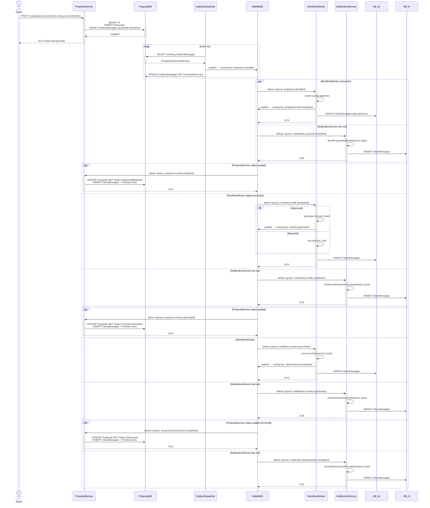
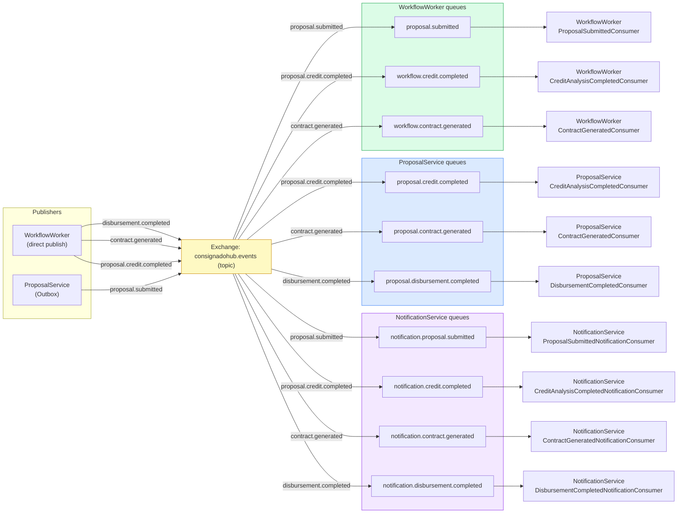
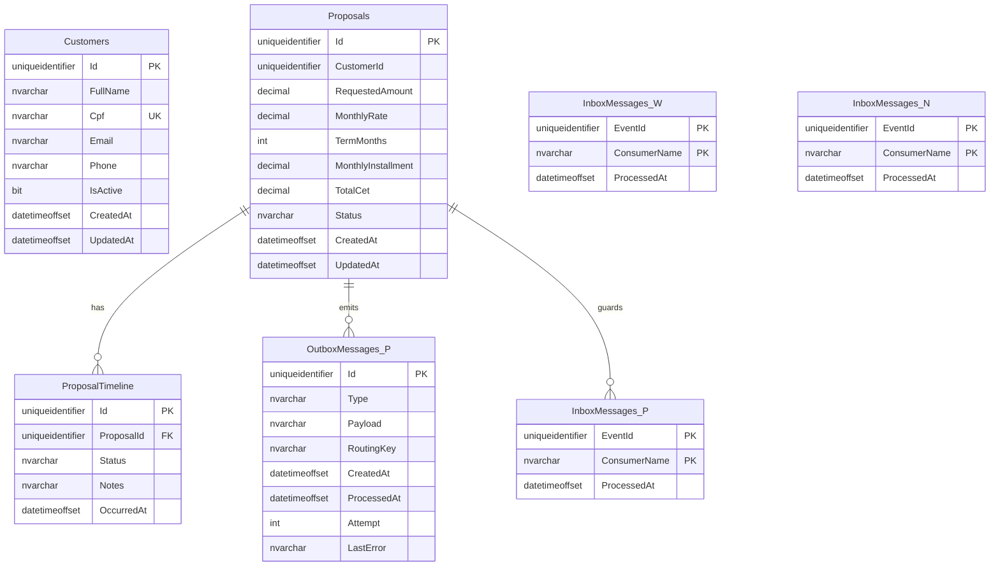
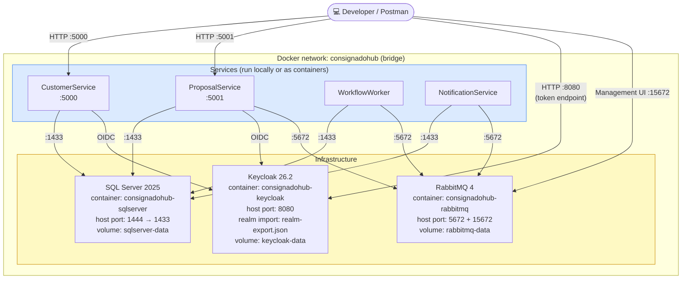
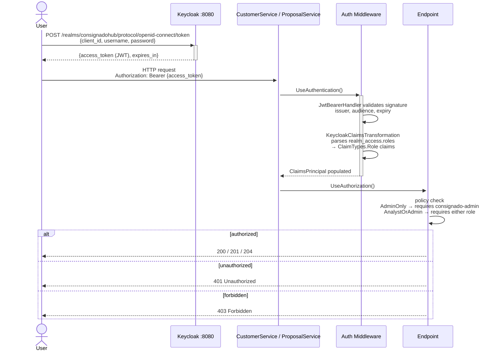
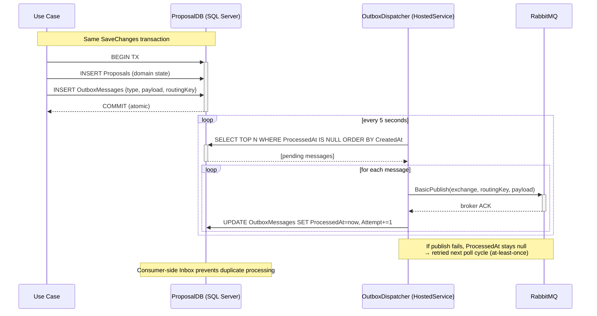

# Architecture Diagrams

All diagrams use [Mermaid](https://mermaid.js.org/) and render natively on GitHub.

---

## 1. System Context

Who uses the system and what external dependencies exist.

## 2. Container Diagram

All services, their databases, and messaging relationships.

---

## 3. Clean Architecture — Per-Service Layers

Each service follows the same layered structure. ProposalService is shown as the most complete example.

---

## 4. Event-Driven Workflow — Sequence Diagram

The complete proposal pipeline from HTTP submit to disbursement.

---

## 5. Messaging Topology — Exchange Bindings

All queues bound to the `consignadohub.events` topic exchange.

---

## 6. Database Schema

One database per service. All use EF Core with SQL Server.

---

## 7. Deployment — Local Docker Compose

---

## 8. Authentication & Authorization Flow

---

## 9. Outbox Pattern — Reliability Detail

